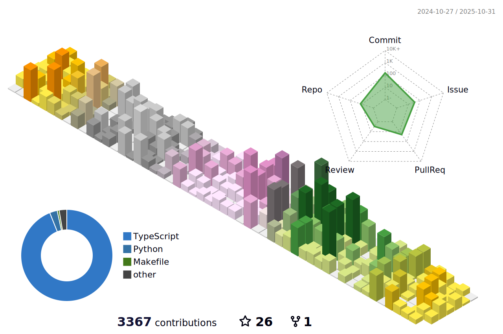

<h1 align="center">Hi 👋, I'm kinjo shotaro</h1>
<h3 align="center">A passionate frontend developer from Japan</h3>

  

  

  

- 🔭 I’m currently working on [株式会社OHMYGOD](https://ohmygod.jp/)

- 🌱 I’m currently learning **Nest.js**

- 👨‍💻 All of my projects are available at [kinjyo1130.vercel.app](https://kinjyo1130.vercel.app)

- 📫 How to reach me **abcshotaro616@gmail.com**

<h3 align="left">Connect with me:</h3>

<h3 align="left">Languages and Tools:</h3>

                        

&nbsp;

## profile-3d-contrib

